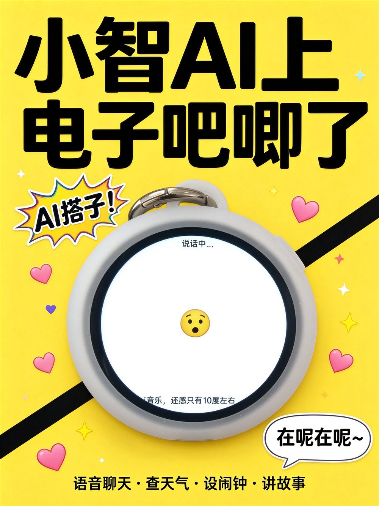
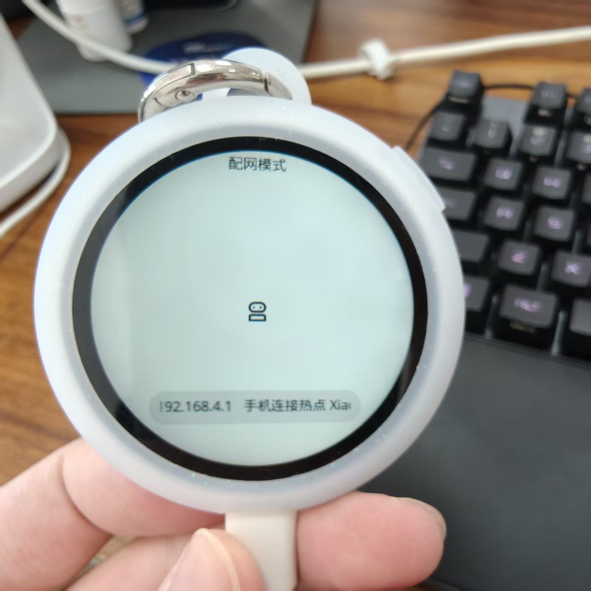
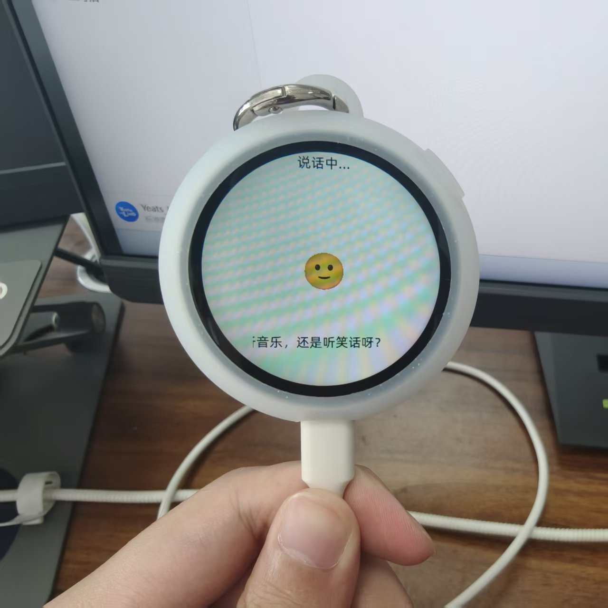
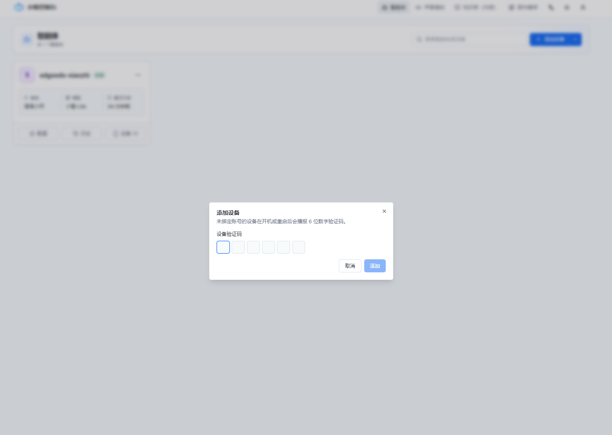
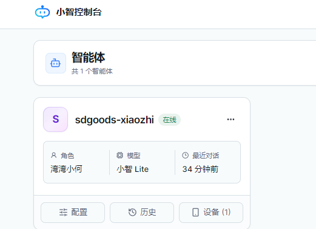
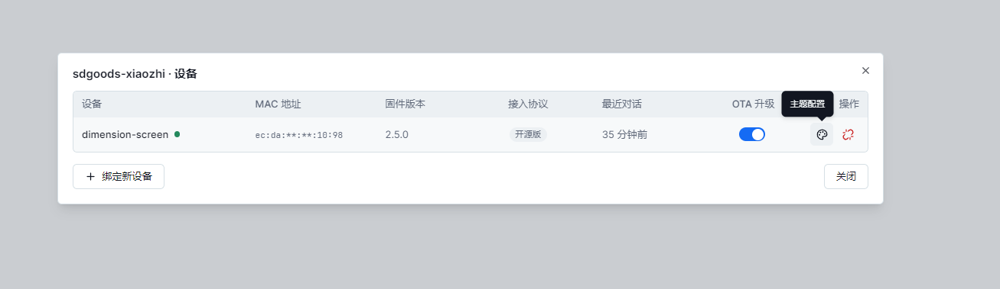
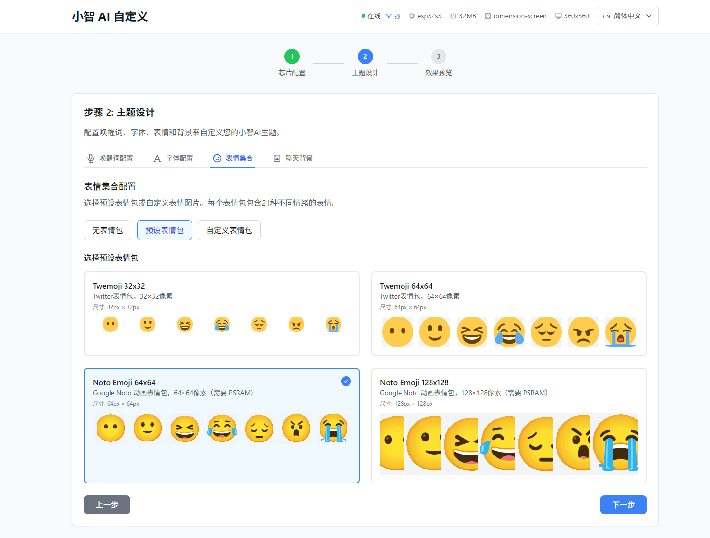

# 谷仓次元屏 × 小智 AI

把开源语音助手 [小智 AI](https://github.com/78/xiaozhi-esp32) 移植到 SDGOODS 谷仓次元屏（ESP32-S3 圆形触摸屏）。上电后说「你好小智」即可与大模型语音对话，屏幕显示表情与字幕；从顶部下滑唤出控制中心，调节音量、亮度，查看网络与电量，熄屏或关机。



| 配网模式 | 对话中 |
|:---:|:---:|
|  |  |

    

基于上游 `v2.5.0` 的移植，新增板型 `SDGOODS Dimension Screen`；上游完整文档见 [README_xiaozhi.md](README_xiaozhi.md)。

## 功能

- **离线唤醒**：本地运行 ESP-SR，不联网也能识别「你好小智」
- **语音对话**：接入 Qwen / DeepSeek 等大模型，屏幕显示表情与字幕
- **下拉控制中心**：触摸手势操作，音量 / 亮度 / 网络 / 电池 / 熄屏 / 关机
- **电池管理**：实时电量、低压提醒、自锁闩一键关机
- **设备端 MCP**：`self.screen.sleep` / `wake` / `set_brightness` 可被大模型调用
- **圆屏适配**：中文界面、手绘图标、字幕避让圆形边缘

## 快速开始

不用编译，直接刷发布好的整机镜像。

1. 从 [Releases](https://github.com/YeatsLiao/sdgoods-xiaozhi/releases) 下载 `sdgoods-xiaozhi-full.bin`（约 11MB）。
2. 接上 USB-C，出现 `USB-JTAG/Serial` COM 口（下例为 `COM6`），一条命令整片刷入：

   ```powershell
   esptool.py --chip esp32s3 -p COM6 -b 460800 write_flash 0x0 sdgoods-xiaozhi-full.bin
   ```

3. 刷完自动重启。会覆盖原厂固件，想退回走平台安装通道重刷即可。

## 联网与激活

刷完固件后，先配网、再添加设备即可对话。

**1. 配网**：短按侧面键（GPIO6），手机连热点 `Xiaozhi-xxxx`，浏览器打开 `192.168.4.1` 选 WiFi。联网后设备会语音播报一串 **6 位验证码**。

**2. 添加设备**：电脑打开 [小智控制台](https://xiaozhi.me/console/agents)，点**添加设备**填入验证码，系统会自动创建一个智能体（如 `sdgoods-xiaozhi`）并绑好设备。





**3. 开聊**：对着设备说「**你好小智**」。

> 换主题（唤醒词 / 表情包 / 背景）在智能体的「小智 AI 自定义」里改，保存后重启生效；设备列表的 **OTA 开关** 控制是否接收固件更新。
>
> 

## 控制中心

| 操作 | 手势 |
|---|---|
| 打开 | 主界面从顶部向下滑 |
| 收起 | 黑色区域向上滑 |
| 返回上一级 | 左边缘向右滑 |
| 一键全关 | 二级页上滑 |

设置页含音量 / 亮度 / 网络 / 电池 / 熄屏，一级页含关于与关机。亮度最低保留 1 档并掉电记忆；语音「关闭屏幕」是熄屏不是断电。

## 硬件

| 项目 | 规格 |
|---|---|
| MCU | ESP32-S3，双核 240MHz，8MB Octal PSRAM，32MB Flash |
| 屏幕 | 圆形 360×360，ST77916，QSPI |
| 触摸 | CST816S 电容触摸（I2C，地址 0x15） |
| 音频 | 板载数字麦 + I2S 功放 |
| 电源 | 电池 ADC 采样 + 自锁闩关机；侧面功能键 GPIO6 |

<details>
<summary>引脚分配</summary>

| 部件 | 关键引脚 |
|---|---|
| 屏幕 ST77916 | PCLK 40 / CS 21 / D0-D3 46,45,42,41 / RST 9 |
| 背光 | GPIO13（显示电源 GPIO12） |
| 触摸 CST816S | SDA 11 / SCL 10 / RST 5 / INT 4 |
| 麦克风（I2S1） | BCLK 16 / WS 2 / DIN 17 |
| 功放（I2S0） | BCLK 48 / LRCK 38 / DOUT 47 / MCLK 15 / PA GPIO3 |
| 电池 | 采样 GPIO8 / 闩锁 GPIO7 |

</details>

## 开发

需已安装并激活 ESP-IDF 6.1（v2.5.0 起要求 ≥6.0.1）。板型已默认选为 `SDGOODS Dimension Screen`，标准命令直接编：

```powershell
idf.py set-target esp32s3
idf.py build
idf.py merge-bin          # 产物 build/merged-binary.bin
Copy-Item build\merged-binary.bin build\sdgoods-xiaozhi-full.bin   # 重命名为 Releases 里那颗
```

也可用上游批量工具 `python scripts/build.py sdgoods/dimension-screen`（CI 即走此路径）。换板型或调选项用 `idf.py menuconfig`。

板级代码在 `main/boards/sdgoods/dimension-screen/`，注册点为 `main/CMakeLists.txt`（`BOARD_DIR` 机制）、`main/Kconfig.projbuild` 与板目录下的 `config.json`。

本仓库不保留上游提交历史：根提交是上游 `v2.5.0` 的基线快照（MIT），其后全部是移植提交。跟随上游升级：`git fetch upstream --tags` 后对照 `git diff <旧tag> <新tag>`，手动把改动搬进板级代码与 `main/`。

## 许可

本移植同样以 **MIT** 开源（见 [LICENSE](LICENSE)）；依赖的上游与各组件各自遵循其许可证：

| 组件 | 许可证 |
|---|---|
| sdgoods-xiaozhi（本移植） | MIT |
| 上游 xiaozhi-esp32 | MIT |
| ESP-IDF | Apache-2.0 |
| LVGL | MIT |
| ESP-SR（唤醒词 / AFE） | Espressif 组件许可（模型另计） |

> 本项目与 SDGOODS / 谷仓官方无隶属关系，仅使用该硬件平台；项目名与 SDGOODS 标识不在代码许可授权范围内。

- 上游仓库：<https://github.com/78/xiaozhi-esp32> · 控制台：<https://xiaozhi.me>
- 通用文档：[README_xiaozhi.md](README_xiaozhi.md)（[中文](README_zh.md) / [日本語](README_ja.md)）
