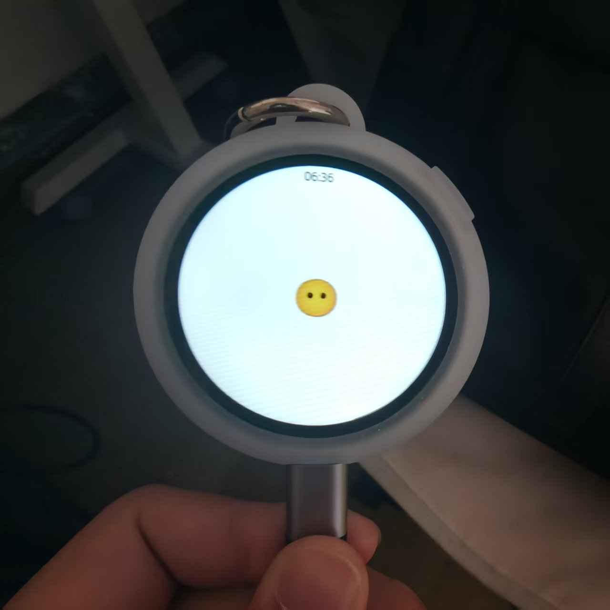
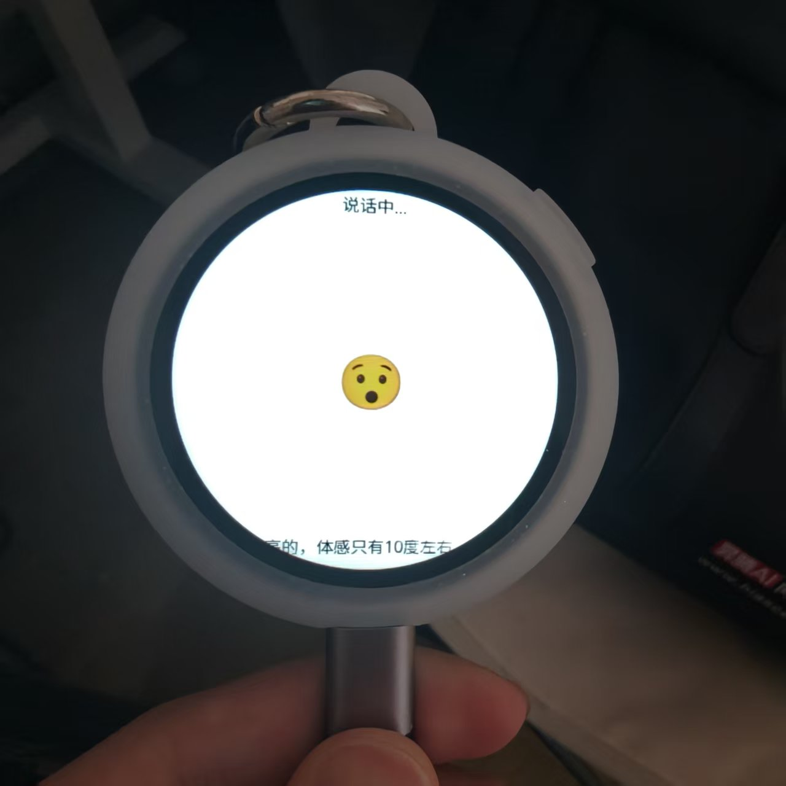

# 谷仓次元屏 × 小智 AI

> 把开源语音助手「小智 AI」装进这块 360×360 的圆形小屏 —— 喊一句 **“你好小智”** 就能和大模型语音聊天，
> 手指往下一滑还有一个能调音量、看电量、熄屏关机的 **控制中心**。

<p align="center">
  
  
</p>
<p align="center"><sub>左：待机表情 · 右：对话中（顶部状态 + 底部滚动字幕）</sub></p>

本项目是 [xiaozhi-esp32](https://github.com/78/xiaozhi-esp32)（上游 tag `v2.4.0`）的移植 fork，
为**谷仓次元屏**（SDGOODS-ESP32S3）新增了板型 `SDGOODS Dimension Screen`。
上游的完整通用文档在 [README_xiaozhi.md](README_xiaozhi.md)（[中文](README_zh.md) / [日本語](README_ja.md)），
**这份 README 只讲这块屏幕怎么把它跑起来。**

---

## ✨ 它能做什么

- 🎙️ **离线唤醒**：本地跑 ESP-SR，喊「你好小智」即响应，不联网也能唤醒
- 💬 **语音对话**：连上大模型（Qwen / DeepSeek 等）实时语音问答，屏幕显示表情 + 滚动字幕
- 🎛️ **下拉控制中心**：纯触摸手势操作，音量 / 亮度 / 数据 / 电池 / 熄屏 / 关机一目了然
- 🔋 **电池友好**：实时电量、低压提醒，控制中心里一键**关机**（自锁闩断电）
- 🛠️ **设备端 MCP**：`self.screen.sleep` / `self.screen.wake` / `self.screen.set_brightness` 可被大模型调用
- 🖐️ **圆屏定制**：控制中心图标为 canvas 手绘线稿、中文界面、字幕胶囊适配圆形可视区

---

## 🚀 三步上手

**1. 编译**（需本机 ESP-IDF 5.5.5；`tools\build.ps1` 已内置路径）

```powershell
powershell -ExecutionPolicy Bypass -File tools\build.ps1
```

**2. 烧录**（⚠️ 会整片覆盖次元屏原厂固件）
用 Espressif **Flash Download Tool** 载入 `build_s3\merged-binary.bin`、地址填 `0x0`，一键烧录最省事。
> 命令行党看 [详细烧录说明](#-详细烧录与产物)。

**3. 联网激活**

1. 上电 → **短按侧面键（GPIO6）** 进入配网，手机连热点 `Xiaozhi-xxxx`
2. 浏览器打开 `192.168.4.1`，选家里 WiFi 填密码
3. 联网后屏幕出二维码 → 到 [xiaozhi.me](https://xiaozhi.me) 扫码绑定
4. 说 **「你好小智」** 开聊 🎉

---

## 🎛️ 控制中心怎么用

| 想做什么 | 怎么手势 |
|---|---|
| 打开 | 主聊天界面**从顶部向下滑** |
| 收起 | 黑色区域**向上滑**（起点落在空白处，别按在圆钮上） |
| 二级页回一级 | **左边缘向右滑** |
| 一键全关 | 二级页**上滑** |

进去后有：**设置页**（音量 / 亮度 / 数据 / 电池 / 熄屏）→ 点开各自二级页；
**一级页**还有「关于」和「关机」。亮度调到最低会保留 1 档防黑屏，且掉电记忆。

> 💡 语音说「关闭屏幕」走的是**熄屏**（背光降到微亮 + 全黑页、触摸即醒），不是真黑屏，免得你以为死机了。

---

<details>
<summary><b>🔧 详细烧录与产物</b>（命令行 / 多文件 / 抓日志）</summary>

**次元屏的 ESP32-S3 走原生 USB**（USB-C 上方口），插上后设备管理器出现 `USB-JTAG/Serial` 的 COM 口。

编译产物在 `build_s3\`：

| 文件 | 烧录地址 | 说明 |
|---|---|---|
| `merged-binary.bin` | `0x0` | **单文件合并固件（约 11MB）**，Flash Download Tool 用它最省事 |
| `xiaozhi.bin` | `0x200000` | 应用固件 |
| `generated_assets.bin` | `0xA00000` | 表情 / 字体 / 唤醒词资源 |
| `bootloader\bootloader.bin` | `0x0` | 引导 |
| `partition_table\partition-table.bin` | `0x8000` | 分区表 |
| `ota_data_initial.bin` | `0x10D000` | OTA 数据 |

命令行多文件烧录（先激活 IDF 环境）：

```powershell
idf.py -B build_s3 -p COM6 flash
idf.py -B build_s3 -p COM6 flash --no-stub   # 原生 USB 握手异常时
```

抓启动日志（原生 USB-JTAG 必须用 `idf.py monitor`，普通串口助手抓不到）：

```powershell
idf.py -B build_s3 -p COM6 monitor
```

Flash Download Tool 配置：SPI Speed `80MHz`、SPI Mode `DIO`、Flash Size `32MB`、晶振 `40MHz`、整片擦除。

</details>

<details>
<summary><b>🔌 硬件规格与引脚</b></summary>

| 部件 | 型号 / 参数 | 关键引脚 |
|---|---|---|
| MCU | ESP32-S3，8MB Octal PSRAM，32MB Flash | — |
| 屏幕 | ST77916 QSPI 圆屏 360×360 | PCLK 40 / CS 21 / D0-D3 46,45,42,41 / RST 9 |
| 背光 | LEDC PWM | GPIO13（显示电源 GPIO12） |
| 触摸 | CST816S 电容触摸（I2C，地址 0x15） | SDA 11 / SCL 10 / RST 5 / INT 4 |
| 麦克风 | 板载数字麦，I2S 控制器 1，32bit mono >>14 | BCLK 16 / WS 2 / DIN 17 |
| 功放 | I2S DAC，I2S 控制器 0，16bit + MCLK + PA | BCLK 48 / LRCK 38 / DOUT 47 / MCLK 15 / PA GPIO3 |
| 按键 | 侧面功能键（对讲 / 配网切换） | GPIO6（低有效） |
| 电池 | 电压采样 ADC1_CH7（1:3 分压）+ 自锁闩电源开关 | 采样 GPIO8 / 闩锁 GPIO7 |

引脚事实源：`SDGOODS-ESP32S3/components/sdgoods_board/include/board_pins.h`、`sdgoods_lcd.h`；
屏幕 vendor 初始化序列取自 SDGOODS BSP 的 `st77916_vendor_init.inc`（屏厂实测）。

</details>

<details>
<summary><b>🧱 功能适配清单</b></summary>

| 功能 | 状态 |
|---|---|
| ST77916 QSPI 圆屏 + 表情 / UI + 圆形安全区适配 | ✅ |
| 背光调节（掉电保存） | ✅ |
| 麦克风 / 功放音频（自写 `SdgoodsAudioCodec`） | ✅ |
| 离线唤醒「你好小智」（ESP-SR） | ✅ |
| 触摸 CST816S（手势驱动控制中心） | ✅ |
| 下拉控制中心（音量/亮度/数据/电池/熄屏/关机） | ✅ |
| 电池电量采样 + 低压提示 | ✅ |
| 自锁闩关机（USB 供电时深睡兜底） | ✅ |
| 设备端 MCP 工具 | ✅ |

</details>

---

## 🧑💻 给开发者

- 上游检出 tag `v2.4.0`（detached HEAD）；开发前先建分支：`git switch -c sdgoods-xiaozhi`
- 板型代码在 `main/boards/sdgoods/dimension-screen/`：
  - `sdgoods_dimension_screen.cc` —— 板级主类（显示 / 触摸 / 音频 / 电源闩 / 控制中心 / 圆屏安全区）
  - `sdgoods_audio_codec.cc/.h` —— 自写 I2S 编解码
  - `config.h` —— 引脚定义；`font_cc_noto_14_4.c` / `font_cc_noto_16_4.c` —— 中文子集字体
- 注册点：`main/Kconfig.projbuild`（`BOARD_TYPE_SDGOODS_DIMENSION_SCREEN`）与 `main/CMakeLists.txt`
- 中文界面用 `Noto Sans SC`（源文件 `tools/fonts/NotoSansSC-Regular.ttf`），`lv_font_conv` 生成子集；
  **新增 `.c` 字体后需 `idf.py reconfigure`**（CMake glob 未开 `CONFIGURE_DEPENDS`）

### ⚠️ 两条踩坑（别回退）

1. **QSPI 圆屏禁用全屏 PSRAM 缓冲**：esp_lvgl_port 的 flush 走 `esp_lcd_panel_io_tx_color`，源在 PSRAM 时
   `spi_master` 要分配等量内部 DMA 回弹缓冲（~259KB），内部保留堆不够 → `setup_dma_priv_buffer` 失败并卡死。
   正解：**内部 SRAM 20 行 DMA 部分缓冲**。
2. **黑页 / 字幕不做半透明过渡**：主界面白底、控制中心纯黑，alpha 淡入会被部分缓冲逐格刷出、被误判成卡顿。
   正解：**瞬间不透明黑覆盖、无淡入淡出**；字幕胶囊收窄抬进圆内，避免下缘弧切。

---

## 📄 许可与链接

上游 xiaozhi-esp32 采用 **MIT** 许可（见 [LICENSE](LICENSE)），本移植同样以 MIT 开源；
依赖的 ESP-IDF / LVGL / ESP-SR 等各自遵循其许可证。

- 上游通用文档：[README_xiaozhi.md](README_xiaozhi.md)（[中文](README_zh.md) / [日本語](README_ja.md)）
- 上游仓库：<https://github.com/78/xiaozhi-esp32> · 控制台：<https://xiaozhi.me>
- 素材生成器（唤醒词 / 字体 / 表情 / 背景）：<https://github.com/78/xiaozhi-assets-generator>
- 开发文档：[自定义板型](docs/custom-board.md) · [MCP 协议](docs/mcp-protocol.md) · [WebSocket](docs/websocket.md) · [MQTT+UDP](docs/mqtt-udp.md)
